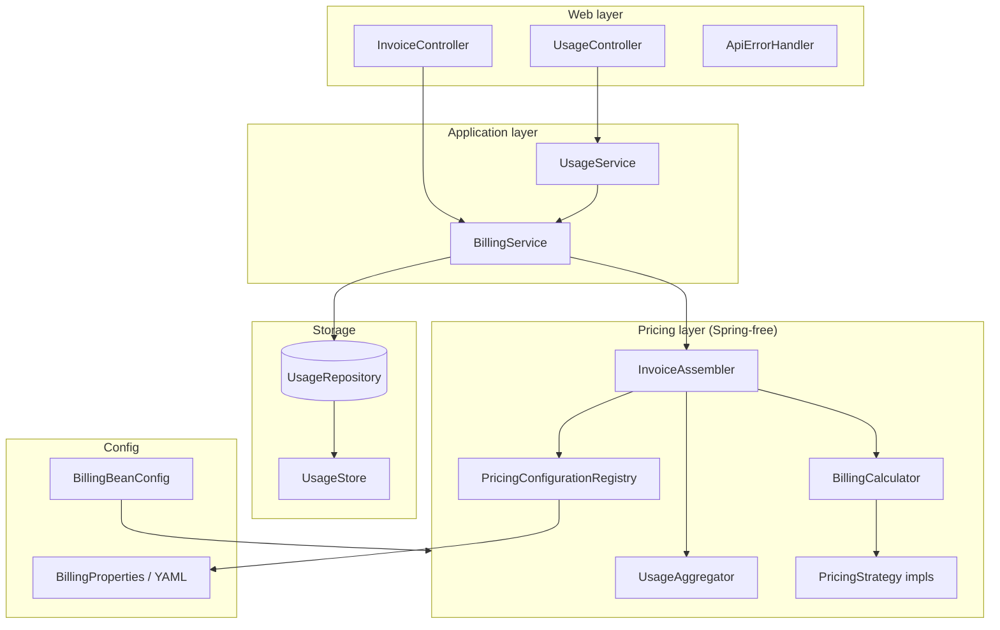

# Architecture & Design Patterns — Interview Guide

Use this document to explain **how this billing service is built** and **why** — in system-design and OOP interviews.

Related: [REQUIREMENTS.md](REQUIREMENTS.md) · [README.md](README.md)

---

## 1. Problem in one sentence

Record usage events per user/resource, apply service-specific pricing rules from config, and produce an invoice for a billing window `[start, end)`.

---

## 2. High-level architecture



### Layer responsibilities

| Layer | Package | Owns | Must NOT own |
|-------|---------|------|--------------|
| Web | `web/` | HTTP, JSON DTOs, validation at boundary | Pricing math, storage details |
| Service | `service/` | Use-case orchestration | HTTP concerns, tier formulas |
| Pricing | `pricing/` | Aggregation, calculation, invoice assembly | Database SQL, REST mapping |
| Domain | `domain/` | Core types + invariants | Framework annotations |
| Storage | `storage/` | Persist / query usage events | Invoice logic |
| Config | `config/` | Wire beans, bind YAML | Business rules |

**Interview line:** *“I separated ingestion, pricing, and invoice assembly so each layer can be tested and replaced independently — that was an explicit assignment requirement.”*

---

## 3. End-to-end flows

### 3.1 Record usage

```
POST /usage
  → UsageRequest (DTO, validated)
  → UsageService.recordUsage()
  → BillingService.recordUsage(UsageEvent)
      → PricingConfigurationRegistry.validateUnit()   // config lookup
      → UsageRepository.save()
```

### 3.2 Generate invoice

```
GET /invoices/{userId}?start=&end=
  → BillingService.generateInvoice()
      → UsageRepository.findByUserAndPeriod()       // filter by [start, end)
      → InvoiceAssembler.assemble()
          → UsageAggregator.aggregate()             // group by service/resource
          → for each service:
              → BillingCalculator.calculateServiceCharge()  // strategy.calculate()
              → BillingCalculator.calculateResourceLineAmounts()
          → build line items, subtotals, total
      → InvoiceCurrencyConverter.convert()          // optional display currency
```

**Key insight:** Period filtering happens **before** aggregation. Events outside `[start, end)` never enter pricing.

---

## 4. Design patterns (with “why”)

### 4.1 Strategy — pricing models

**Where:** `PricingStrategy` → `FlatPricingStrategy`, `TieredPricingStrategy`, `SubscriptionPricingStrategy`, resolved by `PricingStrategyRegistry`.

**What each strategy does:**

| Method | Purpose |
|--------|---------|
| `buildConfig()` | YAML fragment → typed `PricingConfig` |
| `calculate()` | Service-level charge from total quantity |
| `allocateResourceLineAmounts()` | Split service charge across resources |

**Why:** Adding “Graduated with Cap” = new class + YAML schema + `@Bean`. No `switch` in `BillingCalculator`.

**Interview probe answer:**
> “The calculator only asks the registry for the strategy by `BillingType`. It never knows tier math or subscription formulas. That’s Open/Closed in practice.”

---

### 4.2 Template Method — shared line allocation

**Where:** `AbstractPricingStrategy` defaults to proportional split via `ProportionalLineAmountAllocator`. `FlatPricingStrategy` **overrides** to bill each resource independently (`qty × rate`).

**Why:** Tiered and subscription bill at **service level** (one tier walk on aggregated usage). Line items are proportional splits for display. Flat bills each resource directly.

---

### 4.3 Repository — swappable storage

**Where:** `UsageRepository` interface, `UsageStore` in-memory impl.

**Why:** Assignment says persistence is out of scope but must be replaceable. Services depend on the interface, not `ConcurrentHashMap`.

**Production extension:** `PostgresUsageRepository`, partition by `(user_id, billing_month)`.

---

### 4.4 Value Object — safe domain types

| Type | Protects against |
|------|------------------|
| `Money` | float rounding, negative amounts in config |
| `UsageQuantity` | zero/negative/null quantities |
| `BillingPeriod` | invalid ranges; encodes `[start, end)` |
| `ServiceKey` / `UnitKey` | blank identifiers; normalizes service names |

**Interview line:** *“I never pass raw `BigDecimal` for money at domain boundaries — `Money` centralizes scale and rounding.”*

---

### 4.5 Externalized Configuration

**Where:** `application.yml` → `BillingProperties` → `PricingConfigurationRegistry` → runtime `PricingConfig`.

**New service (no code change):**
```yaml
billing:
  pricing:
    archive:
      billing-type: FLAT
      unit: GB_HOUR
      unit-price: 0.03
```

**New billing model (code + config):** new `PricingStrategy` `@Bean` + `BillingType` enum value.

---

### 4.6 DTO — API boundary

**Where:** `UsageRequest`, `UsageResponse`, `InvoiceResponse`, `ErrorResponse`.

**Why:** JSON shape ≠ domain model. Controllers don’t expose `UsageEvent` or `Invoice` records directly.

---

### 4.7 Dependency Injection — framework at the edges

**Where:** Spring `@Service`, `@Repository`, `BillingBeanConfig` `@Bean` methods.

**Important detail:** Pricing classes (`BillingCalculator`, `InvoiceAssembler`, strategies) have **no** Spring annotations. Pure Java → easy unit tests, aligns with “billing logic independent of framework.”

---

## 5. SOLID — mapped to classes

### Single Responsibility

| Class | One job |
|-------|---------|
| `UsageAggregator` | Group events → summaries |
| `BillingCalculator` | Delegate to strategy |
| `InvoiceAssembler` | Build invoice structure |
| `FlatPricingStrategy` | Flat math only |

### Open/Closed

- New pricing model → new strategy; existing strategies untouched.
- New service → YAML only.

### Liskov Substitution

- Any `UsageRepository` impl works in `BillingService`.
- All `PricingStrategy` impls honor the same contract.

### Interface Segregation

- `UsageRepository`: save, find by period, find all — nothing about invoices.
- `UsageAggregationStrategy`: aggregate only.

### Dependency Inversion

- `BillingService` → `UsageRepository` (abstraction)
- `BillingCalculator` → `PricingStrategyRegistry` (not concrete tier class)
- `InvoiceAssembler` → `UsageAggregationStrategy` interface

---

## 6. Data model (mental model)

```
UsageEvent
  userId, resourceId, serviceType, unit, quantity, timestamp

        ↓ UsageAggregator (order-independent)

ResourceUsageSummary  (per user+resource+service)
        ↓ group by service
ServiceUsageSummary   (total qty + list of resources)

        ↓ BillingCalculator + PricingStrategy

Invoice
  lineItems[]      — one per resource
  serviceSubtotals[] — one per service
  total
```

**Out-of-order events:** Aggregator **sums** quantities by key; insertion order irrelevant.

---

## 7. Correctness hotspots (know these cold)

| Topic | Rule in this codebase |
|-------|----------------------|
| Billing period | `[start, end)` — start inclusive, end exclusive |
| Tiered 150 hrs | 100×0.10 + 50×0.08 = 14.00 (service-level) |
| Subscription 1.4M | 50 + 400,000×0.001 = 450.00 |
| Flat 50 GB-hrs | 50×0.02 = 1.00 |
| Money | `BigDecimal`, scale 2, HALF_UP |
| Unit validation | Event unit must match config for that service |

---

## 8. How to extend (common interview follow-ups)

### “Add Graduated with Cap pricing”

1. Add `BillingType.GRADUATED_CAP`
2. Implement `GraduatedCapPricingStrategy`
3. Register `@Bean` in `BillingBeanConfig` (auto-wired into registry)
4. Extend YAML schema (cap amount, tier blocks)
5. **Zero changes** to `FlatPricingStrategy`, `TieredPricingStrategy`, etc.

### “Add a new billable service (e.g. CDN)”

1. Add YAML block under `billing.pricing.cdn`
2. Clients send `serviceType: "cdn"` — no enum change

### “Move to PostgreSQL”

1. Implement `UsageRepository` with JDBC/JPA
2. Index `(user_id, timestamp)` for period queries
3. Services unchanged

### “Handle 10M events/sec” (production)

Current design is in-memory / single-node. Discuss:
- **Ingestion:** Kafka + idempotent consumers
- **Storage:** time-partitioned tables or OLAP rollup
- **Invoice:** pre-aggregate per `(user, service, day)`; invoice = sum of rollups
- **Exactly-once:** event IDs + dedup table

---

## 9. Trade-offs to acknowledge honestly

| Decision | Benefit | Cost |
|----------|---------|------|
| In-memory store | Simple, fast for assignment | Not production-durable |
| Tiered at service level | Matches spec examples | Per-resource tier breakdown is approximate (proportional lines) |
| `BillingType` enum | Type-safe strategy lookup | New model needs enum entry |
| Spring Boot | Fast delivery, DI, REST | Heavier than pure CLI |
| Multi-currency (extra) | Real-world invoices | Beyond single-currency spec |

---

## 10. 60-second “walk me through your design” script

> “Usage enters through a REST API into application services that persist events behind a repository interface. When we generate an invoice, we load events for the user inside the billing window, aggregate them in an order-independent way by service and resource, then for each service we look up pricing config from YAML and delegate calculation to the right strategy — flat, tiered, or subscription. The assembler builds line items and subtotals. Pricing logic is plain Java with no Spring dependencies; the framework only wires components at the edge. New services are config-only; new billing models are a new strategy class plus config schema.”

---

## 11. Files to reference in a live interview

| Topic | File |
|-------|------|
| Strategy contract | `pricing/strategy/PricingStrategy.java` |
| Tier calculation | `pricing/strategy/impl/TieredPricingStrategy.java` |
| Aggregation | `pricing/UsageAggregator.java` |
| Invoice build | `pricing/InvoiceAssembler.java` |
| Config loading | `pricing/registry/PricingConfigurationRegistry.java` |
| Wiring | `config/BillingBeanConfig.java` |
| Spec examples test | `test/.../AssignmentScenarioTest.java` |
