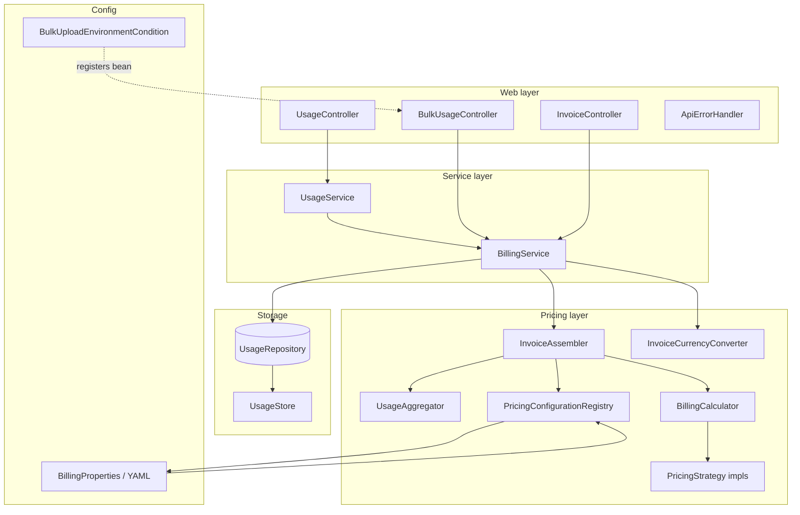

# Architecture & Design Patterns

How this billing service is built and why — for code review and system-design discussions.

Related: [REQUIREMENTS.md](REQUIREMENTS.md) · [README.md](README.md)

---

## 1. Problem in one sentence

Record usage events per user/resource, apply service-specific pricing rules from config, and produce an invoice for a billing window `[start, end)`.

---

## 2. High-level architecture



### Layer responsibilities

| Layer | Package | Owns | Must NOT own |
|-------|---------|------|--------------|
| Web | `web/` | HTTP, JSON DTOs, validation at boundary | Pricing math, storage details |
| Service | `service/` | Use-case orchestration (record usage, generate invoice) | HTTP concerns, tier formulas |
| Pricing | `pricing/` | Aggregation, calculation, invoice assembly | Database SQL, REST mapping |
| Domain | `domain/` | Core types + invariants | Framework annotations |
| Storage | `storage/` | Persist / query usage events | Invoice logic |
| Config | `config/` | Wire beans, bind YAML, conditional features | Business rules |

**Design note:** The codebase uses **direct injection of concrete pricing/storage classes** (not separate port interfaces). The assignment’s “replaceable repository” requirement is met by `UsageRepository`; strategy extensibility is met by `PricingStrategy` + registry.

---

## 3. End-to-end flows

### 3.1 Record usage

```
POST /usage
  → UsageRequest (DTO, validated)
  → UsageRequest.toEvent() → UsageEvent
  → UsageService.recordUsage()
  → BillingService.recordUsage()
      → PricingConfigurationRegistry.validateUnit()
      → UsageRepository.save()          // false if duplicate eventId
      → BillingMetrics (saved / duplicate counters)
```

### 3.2 Generate invoice

```
GET /invoices/{userId}?start=&end=
  → InvoiceQuery
  → BillingService.generateInvoice()
      → UsageRepository.findByQuery()   // UsageQuery.matches() filters period + service
      → InvoiceAssembler.assemble()
          → UsageAggregator.aggregate()           // order-independent sums
          → for each service:
              → BillingCalculator.calculateServiceCharge()
              → BillingCalculator.calculateResourceLineAmounts()
          → build line items, subtotals, total
      → InvoiceCurrencyConverter.convert()        // optional display currency
      → BillingMetrics.recordInvoiceGenerated()
```

**Key insight:** Period filtering happens **before** aggregation. Events outside `[start, end)` never enter pricing.

### 3.3 Bulk ingest (local/dev only)

```
POST /usage/bulk   [only if BulkUploadEnvironmentCondition matches]
  → BulkUsageController
      → load fixture or request payload
      → for each UsageRequest: BillingService.recordUsage(request.toEvent())
```

Beans for bulk upload are **not registered** in disallowed environments (e.g. `prod`). Swagger hides the operation via the same condition.

---

## 4. Design patterns (with “why”)

### 4.1 Strategy — pricing models

**Where:** `PricingStrategy` → `FlatPricingStrategy`, `TieredPricingStrategy`, `SubscriptionPricingStrategy`, resolved by `PricingStrategyRegistry`.

**What each strategy does:**

| Method | Purpose |
|--------|---------|
| `buildConfig()` | YAML fragment → typed `PricingConfig` |
| `calculate()` | Service-level charge from total quantity |
| `allocateResourceLineAmounts()` | Split service charge across resources |

**Why:** Adding a new model = new `@Component` strategy + YAML schema. No `switch` in `BillingCalculator`.

---

### 4.2 Template Method — shared line allocation

**Where:** `AbstractPricingStrategy` defaults to proportional split via `ProportionalLineAmountAllocator`. `FlatPricingStrategy` **overrides** to bill each resource independently (`qty × rate`).

**Why:** Tiered and subscription bill at **service level** (one tier walk on aggregated usage). Line items are proportional splits for display. Flat bills each resource directly.

---

### 4.3 Repository — swappable storage

**Where:** `UsageRepository` interface, `UsageStore` in-memory impl.

**Why:** Assignment requires replaceable persistence. Services depend on the interface, not `ConcurrentHashMap`.

**Storage key:** `userId::resourceId::SERVICE_TYPE` — same user/resource can have different service types tracked separately.

**Production extension:** `PostgresUsageRepository`, index `(user_id, timestamp)`.

---

### 4.4 Value Object — safe domain types

| Type | Protects against |
|------|------------------|
| `Money` | float rounding, negative amounts in config |
| `UsageQuantity` | zero/negative/null quantities |
| `BillingPeriod` | invalid ranges; encodes `[start, end)` |
| `ServiceType` / `UnitType` | typed identifiers; unit validated per service at startup + ingest |

---

### 4.5 Externalized Configuration

**Where:** `application.yml` → `BillingProperties` → `PricingDefinitionRules` (startup validation) → `PricingConfigurationRegistry` → runtime `PricingConfig`.

**New service:** add `ServiceType` + matching `UnitType` enum values + YAML block.

**New billing model:** new `PricingStrategy` `@Component` + `BillingType` enum value.

---

### 4.6 Conditional registration — environment-gated features

**Where:** `@Conditional(BulkUploadEnvironmentCondition.class)` on `BulkUsageController` and the OpenAPI customizer bean.

**Config:** `billing.test.bulk-upload.allowed-environments` (default `local`, `dev`). No active profile is treated as `local`.

**Why:** Production deployments never load test-only endpoints or Swagger entries — not just hidden at runtime, but **beans not created**.

---

### 4.7 DTO — API boundary

**Where:** `UsageRequest`, `UsagePageResponse`, `InvoiceResponse`, `ErrorResponse`.

**Why:** JSON shape ≠ domain model. Controllers don’t expose `UsageEvent` or `Invoice` records directly. `UsageRequest.toEvent()` maps at the boundary.

---

## 5. SOLID — mapped to classes

### Single Responsibility

| Class | One job |
|-------|---------|
| `UsageAggregator` | Group events → summaries |
| `BillingCalculator` | Delegate to strategy |
| `InvoiceAssembler` | Build invoice structure |
| `BillingService` | Record usage + orchestrate invoice generation |
| `FlatPricingStrategy` | Flat math only |

### Open/Closed

- New pricing model → new strategy; existing strategies untouched.
- New service → enum entry + YAML pricing block.

### Liskov Substitution

- Any `UsageRepository` impl works in `BillingService`.
- All `PricingStrategy` impls honor the same contract.

### Dependency Inversion (pragmatic)

- `BillingService` → `UsageRepository` (abstraction)
- `BillingCalculator` → `PricingStrategyRegistry` (not concrete tier class)
- Pricing components injected as concrete `@Component`s — acceptable for this scope; repository and strategy registries remain the main extension points.

---

## 6. Data model (mental model)

```
UsageEvent
  userId, resourceId, serviceType, unit, quantity, timestamp, eventId?

        ↓ UsageAggregator (order-independent)

ResourceUsageSummary  (per user+resource+service)
        ↓ group by service
ServiceUsageSummary   (total qty + list of resources)

        ↓ BillingCalculator + PricingStrategy

Invoice
  lineItems[]        — one per resource
  serviceSubtotals[] — one per service
  total
```

**Out-of-order events:** Aggregator **sums** quantities by key; insertion order irrelevant.

**Query filtering:** `UsageQuery.matches()` applies service filter + `BillingPeriod.contains(timestamp)`.

---

## 7. Correctness hotspots

| Topic | Rule in this codebase |
|-------|----------------------|
| Billing period | `[start, end)` — start inclusive, end exclusive |
| Tiered 150 hrs | 100×0.10 + 50×0.08 = 14.00 (service-level) |
| Subscription 1.4M | 50 + 400,000×0.001 = 450.00 |
| Flat 50 GB-hrs | 50×0.02 = 1.00 |
| Deliverable total | user-1 all three services → **USD 466.00** |
| Money | `BigDecimal`, scale 2, HALF_UP |
| Unit validation | Event unit must match service’s expected unit |

---

## 8. How to extend

### Add Graduated-with-Cap pricing

1. Add `BillingType.GRADUATED_CAP`
2. Implement `GraduatedCapPricingStrategy` as `@Component`
3. Extend YAML schema + `PricingDefinitionRules` validation
4. No changes to existing strategies

### Add a new billable service (e.g. archive)

1. Add `ARCHIVE` to `ServiceType` enum
2. Add matching `UnitType` if needed
3. Add YAML block under `billing.pricing.archive`

### Move to PostgreSQL

1. Implement `UsageRepository` with JDBC/JPA
2. Index `(user_id, timestamp)` for period queries
3. Services unchanged

### Scale ingestion (production discussion)

- **Ingestion:** Kafka + idempotent consumers (`eventId` dedup)
- **Storage:** time-partitioned tables or daily rollups
- **Invoice:** pre-aggregate per `(user, service, day)`; invoice = sum of rollups

---

## 9. Trade-offs

| Decision | Benefit | Cost |
|----------|---------|------|
| In-memory store | Simple, fast for assignment | Not production-durable |
| Tiered at service level | Matches spec examples | Per-resource tier breakdown is approximate (proportional lines) |
| `ServiceType` enum | Type-safe + Swagger | New service needs enum entry |
| Spring Boot + `@Autowired` | Fast delivery, DI, REST | Heavier than pure CLI |
| Multi-currency (extension) | Real-world invoices | Beyond single-currency spec; disable via `billing.currency.enabled=false` |
| Slimmer codebase (no port interfaces) | Less boilerplate, easier to navigate | Less “textbook hexagonal” — repository + strategy remain the swap points |
| Conditional bulk controller | Prod-safe test tooling | Bulk logic lives in one controller class |

---

## 10. 60-second walkthrough script

> “Usage enters through REST into `UsageService`, which maps DTOs to domain events and delegates to `BillingService`. Events persist behind `UsageRepository`. For invoices, we query events inside the billing window, aggregate them order-independently by service and resource, look up YAML-driven pricing config, and delegate math to the right strategy — flat, tiered, or subscription. `InvoiceAssembler` builds line items and subtotals. New billing models are a new strategy bean plus config; new services need an enum entry plus YAML. Test-only bulk ingest is a conditionally registered controller that never loads in prod.”

---

## 11. Key files

| Topic | File |
|-------|------|
| Strategy contract | `pricing/strategy/PricingStrategy.java` |
| Tier calculation | `pricing/strategy/impl/TieredPricingStrategy.java` |
| Aggregation | `pricing/UsageAggregator.java` |
| Invoice build | `pricing/InvoiceAssembler.java` |
| Invoice orchestration | `service/BillingService.java` |
| Config loading | `pricing/registry/PricingConfigurationRegistry.java` |
| Strategy registration | `pricing/strategy/registry/PricingStrategyRegistry.java` |
| Environment gating | `config/BulkUploadEnvironmentCondition.java` |
| Spec examples test | `test/.../AssignmentScenarioTest.java` |
